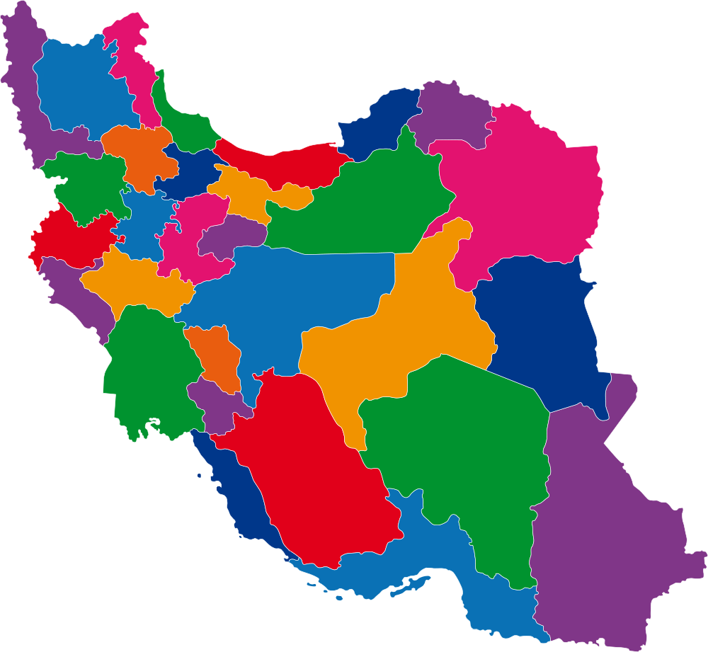

**Project Title**
# Iran Map Silverlight Project (Educational)

**Project Description**
An open source project for programmers and web designers, especially Microsoft Silverlight-based projects.

>{
# پروژه ی نقشه ی سیلورلایت ایران
}>
>{
نقشه ی سیلورلایت ایران پروژه ی متن باز جهت استفاده برنامه نویسان و طراحان وب بخصوص برنامه نویسان پروژه های مبتنی بر سیلورلایت مایکروسافت است، از آنجائیکه عموما کامپوننت های نرم افزاری دارای مشکلات بومی سازی و ناسازگاری با برخی زبان ها مانند زبان فارسی هستند و نیاز شدیدی که در پروژه های ایرانی برای ویژگی های محلی سازی و جهانی سازی (مانند تاریخ شمسی ، زبان فارسی و ... ) وجود دارد در این پروژه نقشه ایران بصورت خیلی ابتدایی طراحی شده است و امید میرود که با همکاری شما دوستان بتوانیم در پیشرفت و افزودن امکانات و قابلیت های آن تلاش کنیم، در صورتیکه شما نیز به این پروژه ملحق میشوید تغییرات و امکاناتی را ککه اضافه میکنید برای همکارانتان به اشتراک بگذارید و ترجیحا این تغییرات را از طریق کنترل سورس چک این کنید .
}>

**Visit My Official Website:[http://www.Alizamani.net](http://www.Alizamani.net).**
  